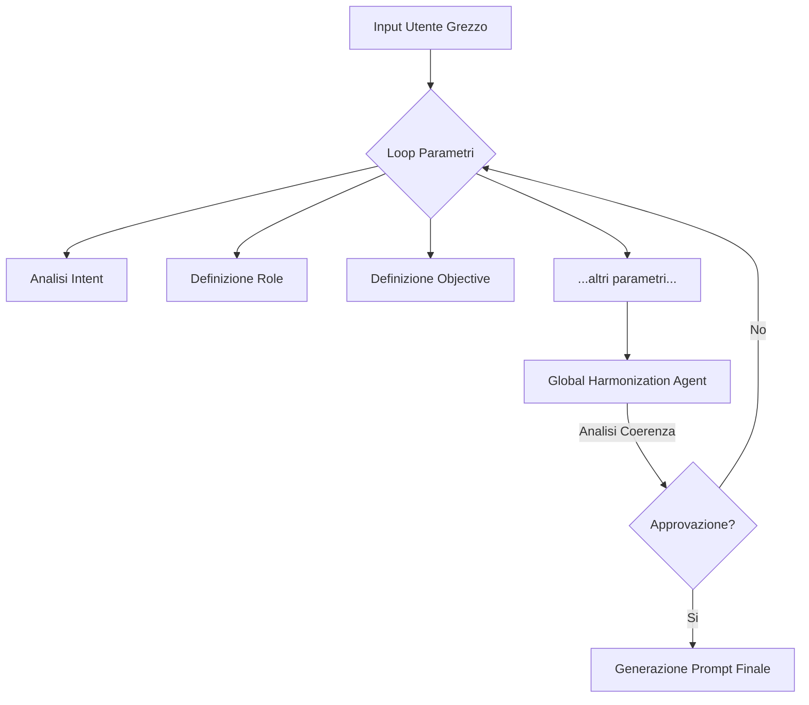

# Prompt Optimizer CLI (v0.1)

> **Nota Operativa:** Questo strumento non è per chi cerca scorciatoie. È un acceleratore cognitivo per chi vuole strutturare il processo di prompting con rigore ingegneristico.

## 📋 Descrizione

**Prompt Optimizer CLI** è un tool da riga di comando progettato per elevare la qualità dei prompt destinati ai Large Language Models (LLM). A differenza dei semplici "abbellitori" di testo, questo software applica una **State Machine** rigorosa per decostruire l'intento dell'utente e ricostruirlo secondo i principi avanzati di Prompt Engineering.

Il sistema guida l'utente attraverso un processo iterativo di definizione dei parametri (Ruolo, Obiettivo, Contesto, Vincoli), applicando una logica di **Revisione Globale** per garantire la coerenza semantica prima della generazione finale.

## ✨ Caratteristiche Principali

  * **Architettura a Stati Finiti:** Il prompt viene costruito step-by-step. Ogni componente (es. *User Intent*, *Audience*) deve essere validato dall'utente.
  * **LLM Agnostic:** Supporto nativo per **Google Gemini** (via `google-generativeai`) e **OpenAI GPT-4/5** (via `openai`).
  * **Global Harmonization Layer:** Al termine della raccolta dati, un agente autonomo rilegge l'intero stato per identificare e risolvere contraddizioni logiche o tonali (pattern *Draft-Review-Finalize*).
  * **Interfaccia CLI Ricca:** Utilizza la libreria `rich` per tabelle, rendering Markdown e pannelli colorati, e `prompt_toolkit` per input multiriga avanzato.
  * **Context Injection & Backtracking:** Il sistema mantiene memoria delle decisioni precedenti per garantire che ogni nuovo parametro sia coerente con lo stato attuale.

## 🛠️ Requisiti di Sistema

  * Python 3.9 o superiore.
  * Una chiave API valida per **Google Gemini** o **OpenAI**.

## 🚀 Installazione

1.  **Clona il repository:**

    ```bash
    git clone https://github.com/tuo-username/prompt-optimizer.git
    cd prompt-optimizer
    ```

2.  **Crea un ambiente virtuale (raccomandato):**

    ```bash
    python -m venv venv
    source venv/bin/activate  # Su Windows: venv\Scripts\activate
    ```

3.  **Installa le dipendenze:**

    ```bash
    pip install -r requirements.txt
    ```

    *(Se non hai il file `requirements.txt`, usa: `pip install rich prompt_toolkit python-dotenv google-generativeai openai`)*

4.  **Configurazione Variabili d'Ambiente:**
    Crea un file `.env` nella root del progetto e inserisci le tue chiavi:

    ```env
    GEMINI_API_KEY=la_tua_chiave_gemini_qui
    OPENAI_API_KEY=la_tua_chiave_openai_qui
    ```

## 💻 Utilizzo

Avvia l'applicazione tramite terminale:

```bash
python optimizer.py
```

### Flusso Operativo

1.  **Selezione Engine:** Scegli tra Gemini o GPT all'avvio.
2.  **Input Grezzo:** Inserisci la tua richiesta iniziale (supporta multiriga: `ESC` + `Invio` per andare a capo).
3.  **Ciclo di Validazione:**
      * Il sistema propone un parametro (es. *ROLE*).
      * **Y:** Confermi e passi al successivo.
      * **N:** Inserisci un feedback correttivo. Il modello rigenera il parametro considerando il tuo input.
4.  **Revisione Globale:** Il sistema analizza l'insieme dei parametri per conflitti (es. *Tono* vs *Audience*) e propone un'armonizzazione.
5.  **Output:** Viene generato il prompt finale in formato Markdown, pronto per l'uso.

## 🧠 Architettura Logica

Il software implementa un pattern di **Inversion of Control**: l'utente non scrive il prompt finale, ma fornisce i vincoli semantici che l'LLM assembla.



## ⚠️ Note Versione (v0.1 Alpha)

Questa è una versione **v0** ("Alpha").

  * Attualmente il contesto è gestito come testo. L'integrazione di documenti (RAG) è prevista nella roadmap futura.
  * Il sistema non salva su file locale di default, ma stampa a video (stdout).

## 📄 Licenza

Distribuito sotto licenza MIT. Vedi `LICENSE` per maggiori informazioni.

-----

*Developed with heavy reliance on rigorous logic.*
